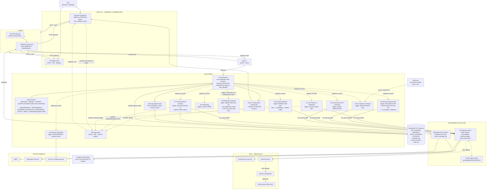

# Welyne HR AI Agent

Multi-agent recruitment platform. Automates the recruitment cycle from job intake to onboarding: CV parsing, candidate scoring, conversational pre-screening, interview scheduling, and structured onboarding — supervised by a single orchestrator with human-in-the-loop gates on every sensitive decision.

---

## Architecture

Monorepo, single `docker compose up` deploys the full stack.



Agents are LangGraph subgraphs executed inside the worker — not separate services. Orchestrator owns the application state machine and is persisted via the LangGraph Postgres checkpointer.

---

## Stack

| Layer            | Choice                                                        |
| ---------------- | ------------------------------------------------------------- |
| API              | FastAPI + Uvicorn (Python 3.12)                               |
| Worker           | Celery + LangGraph (Python 3.12)                              |
| Database         | PostgreSQL 16 + `pgvector`                                    |
| Queue / cache    | Redis 7                                                       |
| LLM inference    | Groq (primary) · Gemini · Mistral (fallback chain)            |
| Structured output| Pydantic v2                                                   |
| Embeddings       | `BAAI/bge-m3` via `sentence-transformers`                     |
| Document parsing | Docling · PyMuPDF · python-docx · Tesseract (fra + eng + ara) |
| Observability    | Langfuse (self-hosted)                                        |
| Frontend         | Next.js 15 · Tailwind · shadcn/ui                             |
| Auth             | FastAPI JWT + bcrypt (roles: admin / recruiter / viewer)      |
| Scheduling       | Cal.com                                                       |
| CI               | GitHub Actions                                                |
| Deploy           | Docker Compose                                                |

---

## Local development

### Prerequisites

- Docker Desktop 24+
- Python 3.12+
- Node 20+

### Setup

```powershell
git clone https://github.com/youssef-medd/HR_agent.git
cd HR_agent
cp .env.example .env
```

Populate `.env`:

- LLM provider keys: `GROQ_API_KEY`, `GEMINI_API_KEY`, `MISTRAL_API_KEY`
- Generate four 256-bit secrets (`python -c "import secrets; print(secrets.token_hex(32))"`):
  `JWT_SECRET`, `LANGFUSE_NEXTAUTH_SECRET`, `LANGFUSE_SALT`, `LANGFUSE_ENCRYPTION_KEY`
- Set service passwords: `POSTGRES_PASSWORD`, `REDIS_AUTH`, `CLICKHOUSE_PASSWORD`, `MINIO_ROOT_PASSWORD`, `LANGFUSE_INIT_USER_PASSWORD`
- Sync `DATABASE_URL` and `REDIS_URL` with the passwords above

### Boot

```powershell
docker compose up -d
docker ps
```

Services: `postgres`, `redis`, `api`, `worker`, `clickhouse`, `minio`, `langfuse-web`, `langfuse-worker`. First boot runs Langfuse database migrations (~2 minutes).

### Verify `pgvector`

```powershell
docker exec -it welyne-postgres psql -U welyne -d welyne_hr -c "CREATE EXTENSION IF NOT EXISTS vector; SELECT extversion FROM pg_extension WHERE extname='vector';"
```

### Provision Langfuse credentials

1. Open <http://localhost:3000>
2. Sign in with `LANGFUSE_INIT_USER_EMAIL` and `LANGFUSE_INIT_USER_PASSWORD`
3. Project `welyne-hr` is auto-created → **Settings** → **API Keys** → **Create**
4. Copy the public and secret keys into `.env` (`LANGFUSE_PUBLIC_KEY`, `LANGFUSE_SECRET_KEY`)
5. `docker compose restart api worker`

---

## Repository layout

```
HR_agent/
├── api/                  FastAPI service (LLM gateway, auth, HTTP endpoints)
├── worker/               Celery + LangGraph agents (A0–A9)
├── frontend/             Next.js dashboard + candidate portal
├── prompts/              /<agent>/<name>@vN.md — prompt registry (spec §5.3)
├── evals/                Evaluation harness (parser, scoring, bias probe)
│   └── golden/           Anonymized reference CVs + JDs + recruiter rankings
├── migrations/           Alembic
├── scripts/              Ops utilities (DB init, seeds, ...)
├── docker-compose.yml
├── .env.example
├── DECISIONS.md          Engineering decision log
└── README.md
```

---

## Security & compliance

Candidate data qualifies as personal data under the Tunisian organic law 2004-63 (INPDP) and the GDPR for EU candidates. The EU AI Act classifies recruitment AI as high-risk. The following controls are mandatory.

- Consent captured and timestamped before any conversational pre-screening.
- Human-in-the-loop gate on every rejection, offer, and external publication (LangGraph `interrupt()`).
- Scoring pipeline masks candidate identity (name, photo, age, gender, address, nationality, marital status) before the judge model.
- Full audit log with actor, timestamp, model, and prompt version on every state transition.
- 12-month default retention on closed applications; `POST /candidates/{id}/erase` for on-request deletion.
- Secrets managed via `.env` only; TLS in transit; bcrypt for password hashes; no PII in logs or Langfuse traces.
- Bias monitoring: score-distribution checks per job and identity-swap invariance tests run in CI before any shortlist ships.

---

## Contributing

- Trunk-based development; small pull requests reviewed within 24 hours; CI green before merge.
- Every stack decision or deviation from the spec is logged as an ADR in `DECISIONS.md`.
- Prompts are versioned in `/prompts/<agent>/<name>@vN.md` — a change means a new version file, never an in-place edit.
- Every bug report cites the corresponding Langfuse trace.
